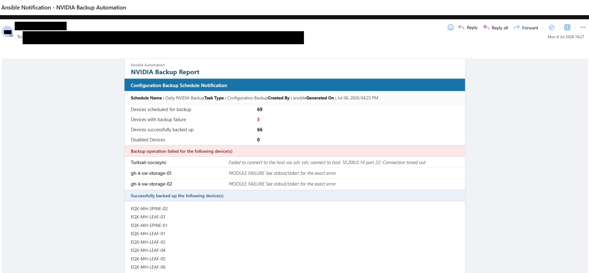

# Introduction

This repository contains Ansible playbooks and related files for automating backup and configuration management tasks on Cumulus Linux network devices. The playbooks are designed to streamline operations such as backing up configurations, restoring configurations, and managing device settings.

Playbook gets `startup.yaml` files from several `Cumulus` devices and compare them with the previous one. Summary all the proccess and *config changes* in a easy-to-understand email format. Also always save `latest` config as a reference point. 

Tested on several `SN Series` devices from NVIDIA with Cumulus OS versions `5.5`, `5.8`, `5.10` and `5.11`.

Only purpose of this repo is to help anyone out there searching similar project. So feel free to use, share, fork, edit etc as much as you want.

## Sample Backup Automation Report

## Prerequisites

- Ansible installed on your control machine.
- Access to Cumulus Linux devices with appropriate permissions.
- SSH access to the devices.
- Basic understanding of Ansible and YAML syntax.
- Python installed on the control machine (for Ansible).

## Setup

1. Clone the repository to your local machine:
2. Navigate to the repository directory:
    cd Cumulus-Backup-Automation
3. Install any required Ansible collections or roles (if applicable).
4. Update the inventory file (inventory.ini) with your Cumulus Linux device details. Sample `inventory.ini` is inside the code.
5. Update the playbooks with any specific configurations or tasks as needed.

## Playbook Folder Tree

~~~bash
.
├── ansible-git-script.sh
├── ansible.cfg
├── callback_plugins
│   ├── __pycache__
│   │   └── email_playbook_results.cpython-310.pyc
│   └── email_playbook_results.py
├── inventory.ini
└── nvidia-backup-playbook.yaml

2 directories, 6 files
~~~

## Running the Playbook

- To run a specific playbook, use the following command:

~~~bash
ansible-playbook -i inventory.ini playbook_name.yml
~~~

- Monitor the output for any errors or confirmations of successful execution.
- Check the backup directory specified in the playbook to verify that backups have been created successfully.

## Playbook Variables

You can change below variables in the playbook as per your requirements.

~~~yaml
  vars:
    dest_path: "/root/{{ datacenter }}"
    folder: "{{ dest_path }}/{{ inventory_hostname }}/{{ hostvars['localhost']['backup_date'] }}"
    filename: "{{ folder }}/backup_{{ hostvars['localhost']['backup_date'] }}_{{ hostvars['localhost']['backup_time'] }}.tgz"
    latest_file: "{{ dest_path }}/{{ inventory_hostname }}/latest/latest.tgz"
~~~

- `dest_path`: The base directory where backups will be stored.
- `folder`: The specific folder for the current backup, organized by hostname and date.
- `filename`: The full path and name of the backup file.
- `latest_file`: The path to the latest backup file for easy access.
- `datacenter`: A variable that should be defined in your inventory or playbook to specify the data center name.
- `backup_date` and `backup_time`: Variables that should be defined in your playbook or inventory to timestamp the backups.
- `inventory_hostname`: A built-in Ansible variable that represents the current host being managed.

## Callback Plugin for Email Notifications

- The repository includes a custom callback plugin (`email_playbook_results.py`) that sends email notifications with the results of playbook executions.
- Update `SMTP_PORT`, `SMTP_ADDRESS`, `FROM_ADDRESS` and `TO_ADDRESS` in the pluging code. You can add as many `TO_ADDRESS`.
- Ensure that the callback plugin is placed in the `callback_plugins` directory and that Ansible is configured to use it.

## Output Folder Sample

~~~bash
root:~/equinix/EQX-MH-LEAF-01# ls
2026-05-27  2026-05-31  2026-06-04  2026-06-08  2026-06-12  2026-06-16  2026-06-20  2026-06-24  2026-06-28  2026-07-02  2026-07-06
2026-05-28  2026-06-01  2026-06-05  2026-06-09  2026-06-13  2026-06-17  2026-06-21  2026-06-25  2026-06-29  2026-07-03  latest
2026-05-29  2026-06-02  2026-06-06  2026-06-10  2026-06-14  2026-06-18  2026-06-22  2026-06-26  2026-06-30  2026-07-04
2026-05-30  2026-06-03  2026-06-07  2026-06-11  2026-06-15  2026-06-19  2026-06-23  2026-06-27  2026-07-01  2026-07-05
~~~

## Security Considerations

- Ensure that sensitive information such as passwords and API keys are managed securely, using Ansible Vault or environment variables.
- Regularly update Ansible and related dependencies to mitigate security vulnerabilities.

### Contributing

- Feel free to fork the repository and submit pull requests for improvements or additional features.
- Please ensure that your code adheres to the existing style and includes appropriate documentation.
- Report any issues or bugs via the repository's issue tracker.
